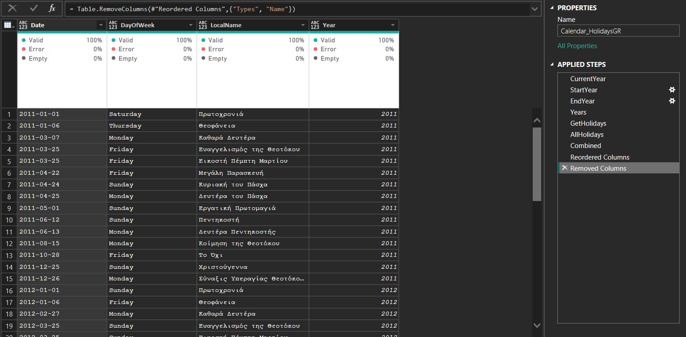

# powerquery-public-holidays-gr
Dynamic Power Query solution for Greek public holidays, automatically generating past and future years using native Power BI functionality

# Power Query – Public Holidays (Greece)

This Power Query (M) script retrieves **official public holidays for Greece** using the
[Nager.Date public API](https://date.nager.at).

It implements a **fully dynamic but controlled approach**, generating holidays for a **fixed and predictable time window**:
- **15 years in the past**
- **10 years in the future**

The year range is calculated automatically based on the **current system date at refresh time**, ensuring long-term usability without manual maintenance.

The solution relies exclusively on **native Power BI (Power Query) functionality**.

---

## Business Scenario

In enterprise BI solutions, date-related logic must be:
- Predictable
- Stable across refresh cycles
- Aligned with historical and future reporting needs

Typical scenarios include:
- Historical trend analysis
- SLA and lead-time calculations
- Workforce and capacity planning
- Forward-looking KPIs and forecasts

A controlled multi-year holiday calendar supports these scenarios without requiring frequent model changes.

---

## Solution Overview

The script:
1. Detects the current year dynamically at refresh time
2. Generates a **fixed business-oriented range**:
   - 15 years back (historical reporting)
   - 10 years forward (planning & forecasting)
3. Calls the public holidays API for each year
4. Combines all results into a single holiday table
5. Uses only native Power BI / Power Query capabilities

This design balances **automation** with **business predictability**.

---

## Output Columns

| Column | Description |
|------|-------------|
| Date | Holiday date |
| DayOfWeek | Day name |
| LocalName | Local holiday name |
| Year | Calendar year |

---

## Country Scope & Extensibility

The current implementation retrieves **Greek public holidays (GR)**.

However, the approach is **easily extensible**:
- The country code can be parameterized
- Additional countries can be supported using the same logic
- Suitable for multinational BI models

This makes the solution adaptable to both **local** and **multi-country** reporting scenarios.

---

## How to Use in Power BI

1. Open **Power BI Desktop**
2. Go to **Transform Data**
3. Open **Advanced Editor**
4. Paste the script from `PublicHolidays_GR.pq`
5. Click **Done**
6. Refresh the model

---

## Why a Fixed Dynamic Range?

Using a fixed but dynamically calculated range:
- Avoids hardcoded dates
- Ensures report stability over time
- Supports both historical analysis and future planning
- Aligns with BI governance and best practices

---

## Notes & Limitations

- Depends on a third-party public API
- Internet access required during refresh
- Subject to API availability and rate limits

---

## License

MIT License
